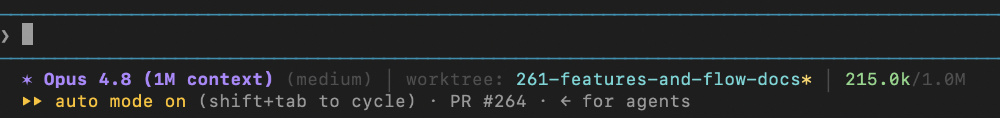

# claude-config

My personal Claude Code configuration (`~/.claude`), version-controlled.

## Statusline



## Setting up on a new machine

```bash
# 1. Clone this repo to a location of your choice
git clone git@github.com:akshadpai/claude-config.git ~/claude-config

# 2. Remove any existing config and create a symlink
rm -rf ~/.claude
ln -s ~/claude-config ~/.claude
```
